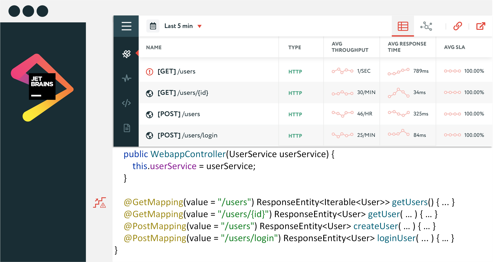

## Description

<!-- Plugin description -->
SourceMarker is a JetBrains-powered plugin which provides continuous feedback capabilities via integration with [Apache SkyWalking](https://github.com/apache/skywalking). SourceMarker increases software development productivity via the Feedback-Driven Development (FDD) approach, a methodology of combining IDE and APM technology to create tighter feedback loops.
<!-- Plugin description end -->

## Features

- Source code contextual user interface
- Service, service instance, endpoint metrics
- Database access metrics
- Integrated distributed trace mapping
- Performance anti-pattern detection
  - Performance Ramp

## Demonstration

## Installation

- Using IDE built-in plugin system:
  
  <kbd>Preferences</kbd> > <kbd>Plugins</kbd> > <kbd>Marketplace</kbd> > <kbd>Search for "SourceMarker"</kbd> >
  <kbd>Install Plugin</kbd>
  
- Manually:

  Download the [latest release](https://github.com/sourceplusplus/SourceMarker/releases/latest) and install it manually using
  <kbd>Preferences</kbd> > <kbd>Plugins</kbd> > <kbd>⚙</kbd> > <kbd>Install plugin from disk...</kbd>

## Usage

- [Getting Started](docs/getting-started.md)
- [Quick Start](docs/quick-start.md)

# Development

## Project Structure

### Framework

| Module                        | Description                                                          | Version |
| ----------------------------- | -------------------------------------------------------------------- | ------- |
| :mapper                       | Tracks source code artifact refactoring                              | 0.1.0   |
| :marker                       | Used to tie visual marks & popups to source code artifacts           | 0.1.0   |
| :mentor                       | Produces source code artifact informative/cautionary advice          | 0.1.0   |
| :portal                       | Used to visually display contextualized artifact data/advice         | 0.1.0   |
| :protocol                     | Common communication data models                                     | 0.1.0   |

### Implementation

| Module                        | Description                                                          | Version |
| ----------------------------- | -------------------------------------------------------------------- | ------- |
| :monitor:skywalking           | Apache SkyWalking monitor implementation                             | 0.1.0   |
| :plugin:jetbrains             | JetBrains plugin implementation                                      | 0.1.0   |

## Attribution

This project was highly influenced by [PerformanceHat](https://github.com/sealuzh/PerformanceHat). Thanks for the insights
that made this possible.

## License

[Apache License 2.0](LICENSE)
