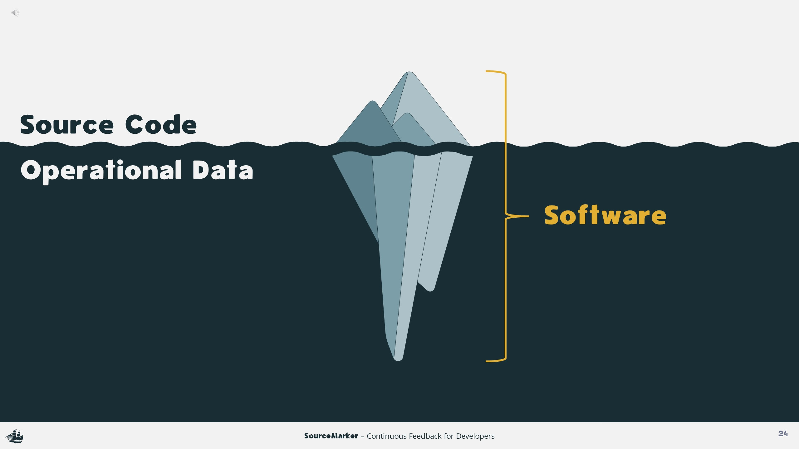

## Description

<!-- Plugin description -->
SourceMarker (alpha) is an APM-powered IDE-based plugin. Inspired by the Feedback-Driven Development approach, SourceMarker combines IDE and APM technology ([requirements](https://github.com/sourceplusplus/SourceMarker/blob/master/docs/getting-started.md#requirements)) to facilitate continuous feedback for software developers. By combining IDE and APM technology, SourceMarker is able to create tighter feedback loops, increase access to production operational metrics, and reduce the cognitive load necessary to comprehend those metrics. SourceMarker aims to provide the framework for the dissemination of software operational metrics and advice.
<!-- Plugin description end -->

## Features

- Source code contextual user interface
- Service, service instance, endpoint metrics
- Database access metrics
- Integrated distributed trace mapping
- Active exception correlation/tracking

## Demonstration

<table>
  <tr>
      <td width="33%" align="center"><b>Logging (Promo)</b></td>
      <td width="33%" align="center"><b>Tracing (Promo)</b></td>
      <td width="33%" align="center"><b>Alerting (Promo)</b></td>
  </tr>
  <tr>
     <td></td>
     <td></td>
     <td></td>
  </tr>
</table>

<table>
  <tr>
      <td width="50%" align="center"><b>Talk</b></td>
      <td width="50%" align="center"><b>Screencast</b></td>
  </tr>
  <tr>
     <td></td>
     <td></td>
  </tr>
</table>

## Installation

- Using IDE built-in plugin system:
  
  <kbd>Preferences</kbd> > <kbd>Plugins</kbd> > <kbd>Marketplace</kbd> > <kbd>Search for "SourceMarker"</kbd> >
  <kbd>Install Plugin</kbd>
  
- Manually:

  Download the [latest release](https://github.com/sourceplusplus/SourceMarker/releases/latest) and install it manually using
  <kbd>Preferences</kbd> > <kbd>Plugins</kbd> > <kbd>⚙</kbd> > <kbd>Install plugin from disk...</kbd>

## Usage

- [Getting Started](docs/getting-started.md)
- [Quick Start](docs/quick-start.md)

# Development

## Project Structure

### Framework

| Module                        | Description                                                          | Version |
| ----------------------------- | -------------------------------------------------------------------- | ------- |
| :mapper                       | Tracks source code artifact refactoring                              | 0.2.1   |
| :marker                       | Used to tie visual marks & popups to source code artifacts           | 0.2.1   |
| :portal                       | Used to visually display contextualized artifact data/advice         | 0.2.1   |
| :protocol                     | Common communication data models                                     | 0.2.1   |

### Implementation

| Module                        | Description                                                          | Version |
| ----------------------------- | -------------------------------------------------------------------- | ------- |
| :monitor:skywalking           | Apache SkyWalking monitor implementation                             | 0.2.1   |
| :plugin:jetbrains             | JetBrains plugin implementation                                      | 0.2.1   |

## Attribution

This project was highly influenced by [PerformanceHat](https://github.com/sealuzh/PerformanceHat). Thanks for the insights
that made this possible.

## License

[Apache License 2.0](LICENSE)
