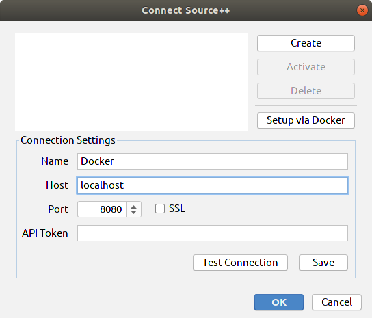
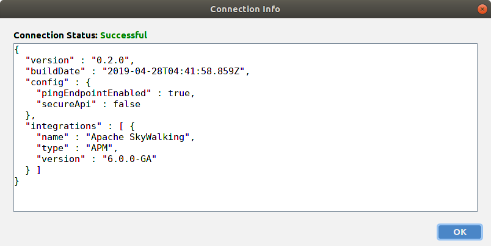

Source++ - Docker Images
---

# How to use?

Step - 1 : Run Source++ Core docker container

```bash
docker run -p 8080:8080 -d sourceplusplus/core:v0.2.0-alpha-skywalking-h2
```

Step - 2 : Connect to Source++ Core container via Source++ Plugin



