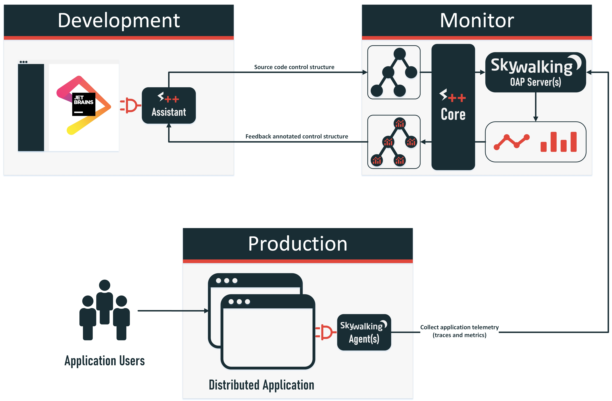
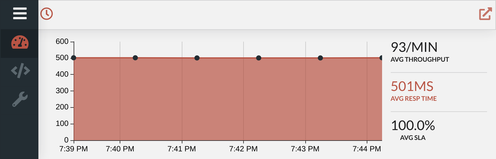
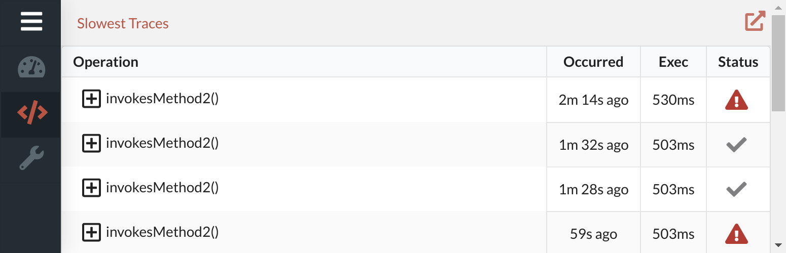
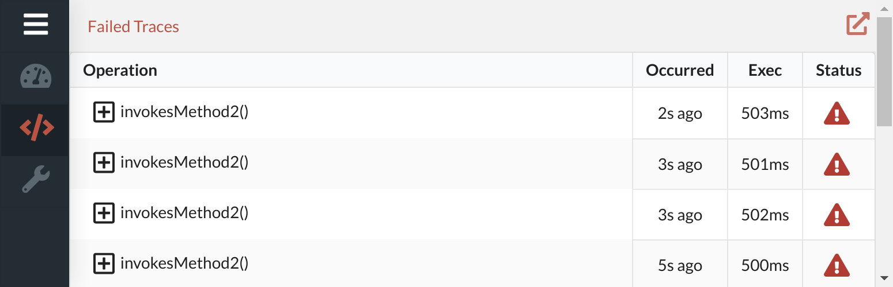
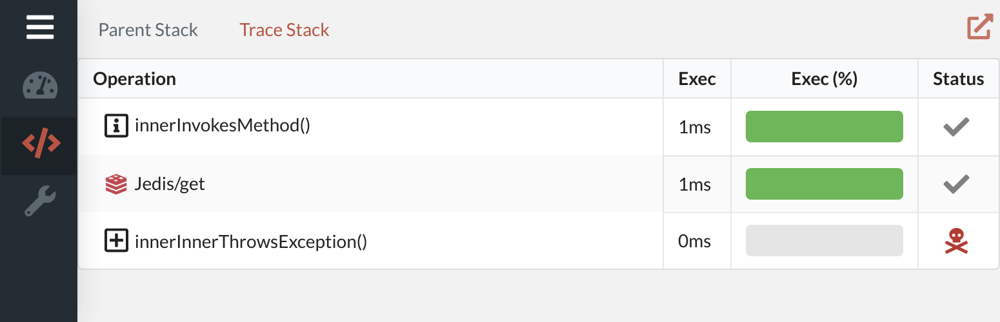
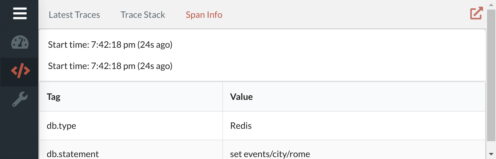
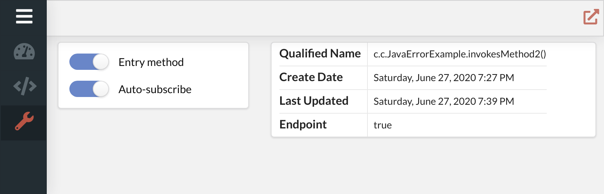

# Architectural Overview

1. Developer(s) write application code
1. Application is deployed with the Apache SkyWalking Agent attached
1. APM agent sends operation data to APM collector which is integrated with Source++ Core
1. Relevant source artifact data is extracted from APM collector and sent to Source++ Plugin
1. Developer(s) activate S++ mark to view live artifact metrics and traces
1. Developer(s) continue developing application with the ability to easily view and improve performance in production

# Source++ Components

## Source++ Core

The Source++ Core is the central component used to coordinate the Source++ Agent as well as keep the Source++ Plugin and Source++ Portal in sync with desired application data. The core also relies heavily on Apache SkyWalking and requires an Apache SkyWalking OAP server to function. The core is the only component in Source++ which must remain consistently online and available.

## Source++ Portal

The Source++ Portal is the most visual portion of Source++. The portal is used to display relevant runtime statistics next to the associated source code artifact. 

The portal currently contains three tabs:

 - Overview
 - Traces
 - Configuration

### Overview

The overview tab displays general artifact statistics to gather an overall view of a source code artifact's runtime behavior. 

### Traces

The traces tab is used to navigate gathered distributed traces. The traces tab is able to display the latest and slowest traces for a given source code artifact. 

#### Latest Traces

#### Slowest Traces

#### Failed Traces

#### Trace Stack

#### Span Info

### Configuration

The configuration tab is used to configure how Source++ handles specific source code artifacts.

## Source++ Plugin

The Source++ Plugin is used to connect the developer's IDE to Source++ as well as the coordination and display of the Source++ Portal.
