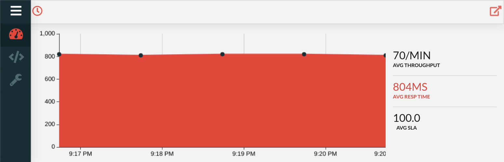
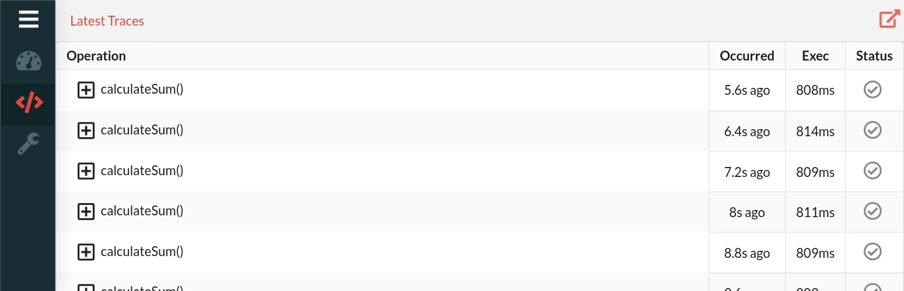

# Architectural Overview

1. Developer(s) write application code
2. Application is deployed with the Source++ Agent using Apache SkyWalking
3. Developer(s) determine which artifacts to subscribe to and send requests to Source++ Core
4. Source++ Core updates Source++ Agent to begin tracing subscribed artifacts
5. APM agent sends operation data to APM collector which is integrated with Source++ Core
6. Relevant source artifact data is extracted from APM collector and sent to Source++ Plugin
7. Developer(s) hover mouse over S++ mark to view Overview tab for artifact's live metrics
8. Developer(s) hover mouse over S++ mark to view Traces tab for artifact's live traces
9. Developer(s) continue developing application with the ability to easily view and improve performance in production

# Source++ Components

## Source++ Agent

The Source++ Agent is used to monitor and gather application data. The agent relies heavily on [Apache SkyWalking](https://github.com/apache/incubator-skywalking) for the metrics and traces it gathers. The agent is primarily used to control the installation/un-installation of plugins and provide additional dynamic functionality to the Apache SkyWalking agent.

## Source++ Core

The Source++ Core is the central component used to coordinate the Source++ Agent as well as keep the Source++ Plugin and Source++ Portal in sync with desired application data. The core also relies heavily on Apache SkyWalking and requires an Apache SkyWalking OAP server to function. The core is the only component in Source++ which must remain consistently online and available.

## Source++ Portal

The Source++ Portal is the most visual portion of Source++. The portal is used to display relevant runtime statistics next to the associated source code artifact. 

The portal currently contains two tabs:

 - Overview
 - Traces

### Overview

The overview tab displays general artifact statistics to gather an overall view of the artifact's runtime behavior. On this tab you can view:

 - Average throughput
 - Average response time
 - 99/95/90/75/50 response time percentiles
 - Minimum/Maximum response time
 - Average SLA

### Traces

The traces tab is used to navigate gathered distributed traces. The traces tab displays the latest traces which a given source artifact created. 

## Source++ Plugin

The Source++ Plugin is used to connect the developer's IDE to Source++ as well as the coordination and display of the Source++ Portal.
