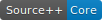
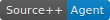

The Source++ Roadmap is a place for high-to-mid-level ideas around the future of Source++.
The purpose of the roadmap is to present a vision for Source++.
As a community of contributors, we can't work together toward something unless their is a shared vision. There are no dates nor deadlines in this roadmap, only a list of milestones.

# Source++ Vision

> The Path to AI-based Pair Programming

The ultimate vision for Source++ is to become a language-agnostic AI-based pair programing observation tool. In a pair programming scenario, there are two participants: the driver (the one who writes the code) and the observer (the one who ensures the code is acceptable). Source++ wishes to fulfill the observer's role with the advantage of seeing both the source code and the runtime behavior of its execution in much greater detail. These details can then be intelligently fed back to the developer during the development of relevant source code. These details could be things like:

- Actively failing source code in production
- Asynchronous method execution side effects
- Root cause detection
- SLA violation prediction
- etc

# Source++ Milestones

## 0.2.0 (alpha)

 - H2 database storage 
 - Application/environment switching 
 - Artifact view sharing  
 - Scala support 
 - Min/max response time in quick stats  
 - Ability to switch overview graph  

## 0.3.0 (alpha)

 - Pinpoint integration  
 - Automated artifact tracing based on overhead limit  
 - Performance predictions 

## 0.4.0 (alpha)

 - stagemonitor integration  

## 0.5.0 (alpha)

 - Apache SkyWalking .NET & JetBrains Rider integration  

## 1.0.0

 - Offline source code analysis (source code augmentations) 
