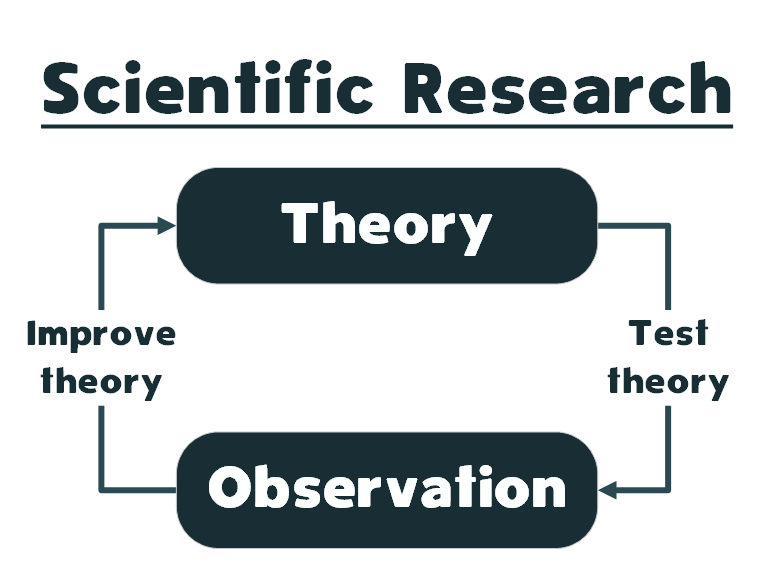
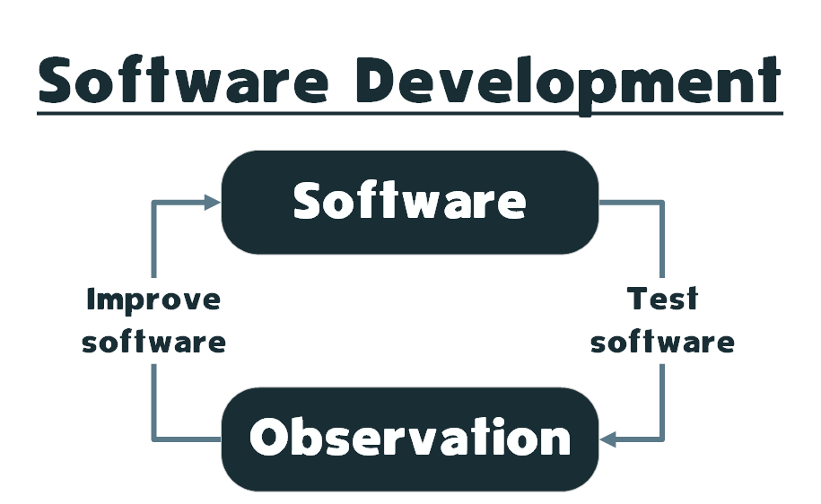
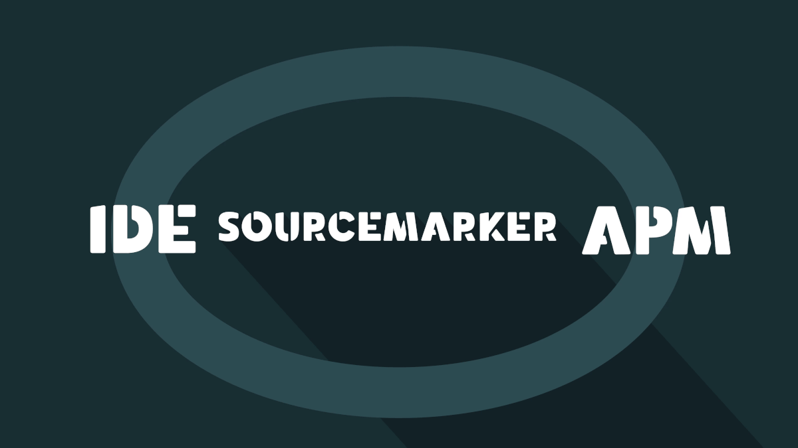

# Continuous Feedback for Developers

## Continuous Feedback

Source code is the specification that describes what can eventually be experienced as software. This transition from theory (source code) to observation (software) is what involves software development in both the theoretical and empirical sciences. While source code is often remarkable to those that develop software, this is not a view shared by those more interested in the value the software provides. From a software user's perspective, source code is typically of little consideration. From a software user's perspective, it is the empirical behavior and not the theoretical structure that ultimately provides value.

This disparity between the software developer and software user perspectives is the same as that of the theoretical vs empirical sciences. The theoretical sciences (aka theory-building) and empirical sciences (aka theory-testing) represent two halves of the research cycle that perpetually iterates between theory and observations. Both perspectives are critical for the advancement of science, and naturally, a complete researcher is one who can traverse the entire research cycle.

Similarly, software development continuously iterates between theory-building via source code and theory-testing via software utilization. In scientific research, elegant theories are not valuable if they do not correlate with reality and mountains of data are equally useless if they do not contribute to meaningful theories. This is identical to the balance between software development and software operation. Source code is not valuable if it is not computable, and software is equally useless if it does not work.

Despite this intrinsic and complementary cycle, today’s software monitoring solutions still gather empirical data and display software operation as time series graphs inside dashboards and other abstractions. These abstractions, while useful, are primarily suitable for operations engineers. Software developers, which contemplate software through the perspective of source code, must continuously convert these abstractions to utilize them during software development. Given an ongoing trend of software development is the blurring boundaries between building and operating software, this is problematic. The solution then involves creating modern programming environments that equally support theoretical and empirical perspectives of software development.

---

## SourceMarker

SourceMarker is an open-source continuous feedback IDE plugin built on top of Apache SkyWalking, a popular open-source APM system with monitoring, tracing, and diagnosing capabilities for distributed software systems. SkyWalking, a truly holistic system, provides the means for automatically producing, storing, and querying software operation metrics. It requires little to no code changes to implement and is lightweight enough to be used in production. By itself, SkyWalking is a formidable force in the realm of continuous monitoring technology.

SourceMarker, leveraging the continuous monitoring functionality provided by SkyWalking, creates continuous feedback technology by automatically linking software operation metrics to source code and displaying feedback directly inside of IDE. While currently only supporting JetBrains-based IDEs and JVM-based programming languages, SourceMarker, and indeed SkyWalking, may be extended to support any number of programming languages and IDEs.

Using SourceMarker, software developers can understand and validate software operation inside of their IDE. Instead of charts that indicate the health of the application, software developers can view the health of individual source code components and interpret software operation metrics from a much more familiar perspective. Such capabilities improve productivity as time spent continuously context switching from development to monitoring would be eliminated.

### Logging

The benefits of continuous feedback technology are immediately apparent in the ability to view and search logs directly from source code. Instead of tailing log files or viewing logs through the browser, SourceMarker allows software developers to navigate production logs just as easily as they navigate source code. By using the source code as the primary perspective for navigating logs, SourceMarker allows software developers to view logs specific to any package, class, method, or line from the context of the source code that resulted in those logs.

### Tracing

Furthermore, continuous feedback technology offers software developers a deeper understanding of software by explicitly tying implicit software operation to source code. Instead of visualizing software traces as Gantt charts, SourceMarker allows software developers to step through trace stacks, automatically resolving trace tags and logs. With SourceMarker, software developers can navigate production software traces in much the same way one debugs local applications.

### Alerting

Most importantly, continuous feedback technology keeps software developers aware of production software operation. Armed with an APM-powered IDE, every software developer can keep track of the behavior of any method, class, package, and even the entire application itself. Moreover, this allows for source code to be the medium through which production bugs are made evident, thereby creating source code with the ability to self-diagnose and display health.

---

## Download SourceMarker

SourceMarker aims to bridge the theoretical and empirical practices of software development through continuous feedback. The idea is essentially to create monitoring-aware and APM-powered IDEs. The goal is to make developing software with empirical data feel natural and intuitive, creating more complete software developers that understand the entire software development cycle.

This project is still very early in its development, so if you think of any ways to improve SourceMarker, please let us know.

- Source code: https://github.com/sourceplusplus/sourcemarker
- JetBrains plugin: https://plugins.jetbrains.com/plugin/15407-sourcemarker